# Resume Analyzer

## Overview

This project builds a resume analysis workflow for matching candidate resumes against a job description using LLM-based extraction and scoring.

The pipeline includes:
- extracting structured data from a job description (`job_desc.py`)
- parsing candidate resumes from PDF or DOCX files (`resume_extr.py`)
- scoring each candidate against the job description (`resume_score.py`)
- orchestrating the full analysis across all resumes in `resumes/` (`resume_analyzer.py`)

## Flow Diagram



## Files

- `job_desc.py`
  - loads a job description and builds a Pydantic schema
  - uses the Groq LLM client to parse the job description into structured JSON

- `resume_extr.py`
  - reads PDF and DOCX resumes from the `resumes/` folder
  - sends resume text to the Groq LLM for structured resume extraction
  - returns candidate fields such as name, email, skills, experience, education, projects, and certifications

- `resume_score.py`
  - compares the parsed resume against the structured job description
  - returns a match score and details in JSON format

- `resume_analyzer.py`
  - orchestrates the full workflow
  - iterates through resumes in `resumes/`
  - reads each resume, extracts structured data, scores it, and prints results

- `flow.tldr`
  - source file for the visual workflow diagram

- `flow.svg`
  - rendered workflow image included in this README

## Setup

1. Create and activate a Python virtual environment:

```powershell
python -m venv .venv
.\.venv\Scripts\Activate.ps1
```

2. Install dependencies:

```powershell
python -m pip install -r pyproject.toml
```

3. Create a `.env` file containing your Groq API key:

```text
GROQ_API_KEY=your_api_key_here
```

## Usage

Run the resume analyzer:

```powershell
python resume_analyzer.py
```

The script will process every supported resume file in the `resumes/` folder and print a score for each candidate.

## Notes

- The Groq LLM model configured in the code is `llama-3.3-70b-versatile`.
- `resume_analyzer.py` currently pauses for 5 seconds between LLM calls to avoid rapid request bursts.
- Supported resume formats: `.pdf`, `.docx`.

## Requirements

- Python 3.13 or newer
- `groq`
- `pydantic`
- `pypdf`
- `python-docx`
- `python-dotenv`

Enjoy using resume analyzer and reviewing the workflow in `flow.svg`!
